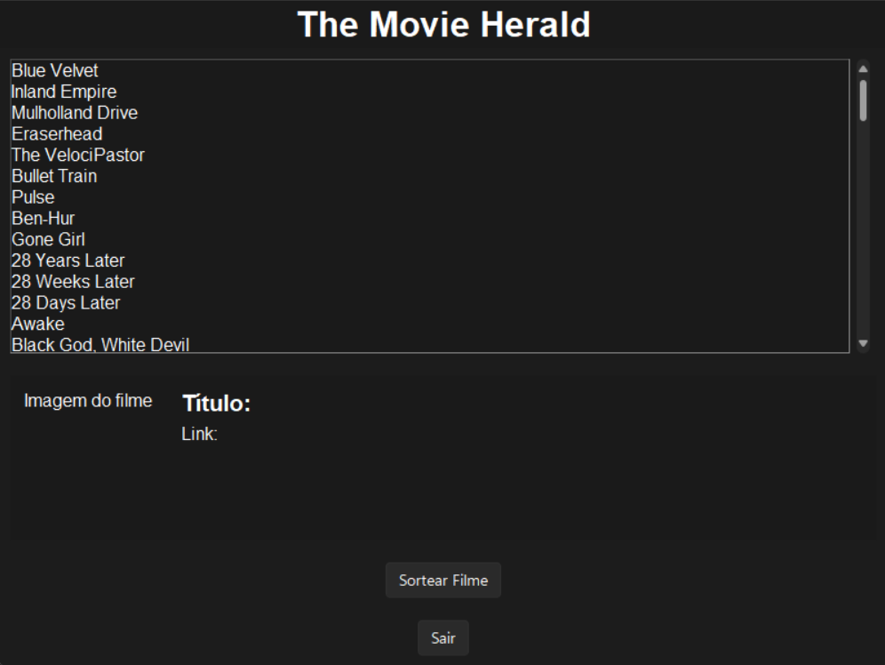
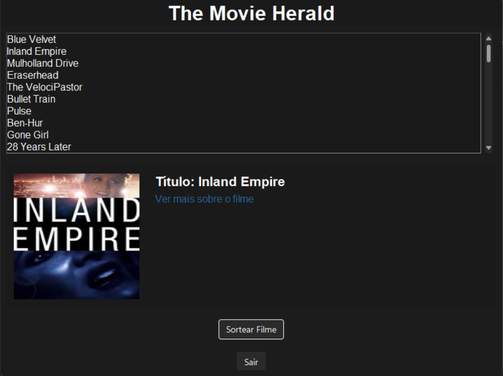

# The Movie Herald

**A software application designed to randomly select a movie from a user's watchlist on Letterboxd.**

The Movie Herald offers an intuitive way to discover movies from your Letterboxd watchlist. Users can select a random film either based on its genre or without any genre constraints, making it a flexible tool for movie enthusiasts.

---

## Features

- **Random Movie Selection**: Choose a movie at random from your Letterboxd watchlist.
- **Genre-Based Filtering**: Narrow down selections based on your preferred genre.
- **Interactive Interface**: A sleek GUI built with Tkinter, enhanced with a dark mode theme.
- **Movie Details**: Displays movie title, poster, and a direct link to its Letterboxd page.
- **Web Scraping**: Seamlessly fetches your watchlist using Selenium and displays movie information.

---

## How It Works

1. Fetch your watchlist from Letterboxd using Selenium.
2. Display the movies in a scrollable list.
3. Randomly select a movie and display its details, including:
   - Title
   - Poster
   - Link to the movie's Letterboxd page

---

## Screenshots

### Main Interface


### Movie Selection Example


---

## Installation

1. Clone the repository:
   ```bash
   git clone https://github.com/d0pp3lg4nger/the-movie-herald.git
   ```
2. Install the required dependencies:
   ```bash
   pip install -r requirements.txt
   ```
3. Run the application:
   ```bash
   python movie_herald.py
   ```

---

## Technologies Used

- **Python**: Core programming language
- **Tkinter**: GUI framework
- **Selenium**: Web scraping and automation
- **Pillow**: Image processing
- **sv_ttk**: Modern dark mode themes for Tkinter

---

## Roadmap

- [ ] Add support for filtering by multiple genres
- [ ] Implement user authentication for private watchlists
- [ ] Enhance performance for larger watchlists

---

## License

This project is licensed under the MIT License. See the [LICENSE](LICENSE) file for details.

